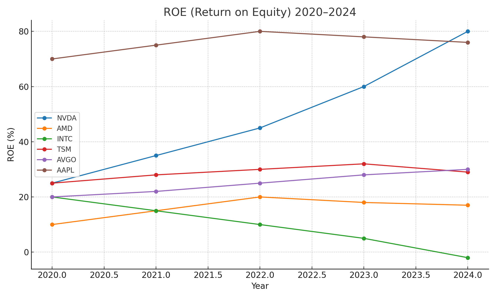
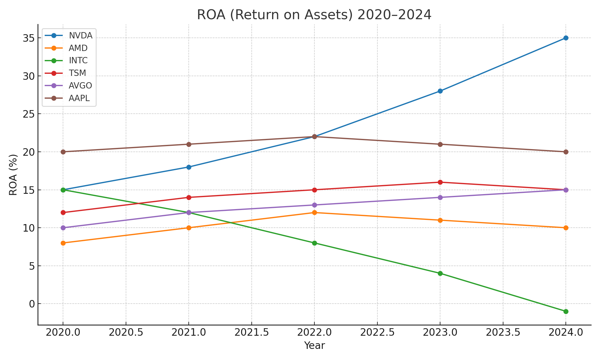

---

# 🔎 **第12章：ChatGPTで比較分析する**  
## Chapter 12: Comparing Tech Stocks Using ChatGPT

---

## 12.1 📌 比較することの意義 | Why Compare?

- 同じセクター内でも、**企業ごとに強み・収益性・将来性は異なる**。  
- 比較することで、**「自分に合った銘柄」や「割安な銘柄」**が見えてくる。  
- ChatGPTを使えば、**効率的に定性・定量情報を整理**できる。  

Even within the same sector, companies differ in strengths, profitability, and future outlook.  
By comparing them, you can identify **the most suitable or undervalued stocks** for your portfolio.  
ChatGPT helps you **structure and visualize both qualitative and quantitative data** efficiently.  

---

## 12.2 🧭 比較項目の基本軸 | Key Comparison Axes

| 項目 | 目的 | English |
|------|------|---------|
| 1. 主な事業領域 | どの分野に注力しているか | Business Focus |
| 2. 収益構造・利益率 | 安定性・成長性の指標 | Profitability |
| 3. 強み・競争優位性 | 長期保有に値するか | Strengths & Moat |
| 4. リスク | 市場・財務・政策など | Risks |
| 5. 成長戦略 | 今後の展開とビジョン | Growth Strategy |

---

## 12.3 💬 ChatGPTプロンプト例 | Prompt Example

```markdown
# 例：NVIDIAとAMDを比較
「NVIDIAとAMDの企業比較を、次の5項目に沿って表形式でまとめてください：
①事業領域 ②収益性 ③強み ④リスク ⑤成長戦略」
```

→ 出力された内容をさらに**手動で補完・検証**することで、一次判断の材料にできる。  

---

## 12.4 📊 比較結果の整理例（NVIDIA vs AMD）  
### Example: NVIDIA vs AMD

| 項目 / Item | NVIDIA | AMD |
|-------------|--------|-----|
| 主な事業領域 | GPU（AI・ゲーム・データセンター） | CPU・GPU（PC・ゲーム・サーバ） |
| 収益性 | 高い（利益率40%超） | 中程度（15〜20%） |
| 強み | CUDA・AI市場支配・技術先行 | コスパ・製品ラインの柔軟性 |
| リスク | 価格高騰による需要減少、競争激化 | 市場シェア奪取競争、粗利変動性 |
| 成長戦略 | AI・自動運転・Omniverse | サーバ市場・クラウド拡大 |

---

## 12.5 🌍 その他の比較対象例 | Other Examples

| 比較対象 | 背景 / Context |
|----------|----------------|
| Tesla vs BYD | EV市場での成長性とグローバル戦略 |
| ASML vs TSMC | 半導体装置 vs 半導体製造 |
| Microsoft vs Google | クラウド・AI・広告収益 |
| Palo Alto vs CrowdStrike | サイバーセキュリティの収益モデル |

---

## 12.6 ⚠️ 比較分析の落とし穴 | Pitfalls to Avoid

- ChatGPTの情報はあくまで**参考**。 → **最新のIR資料・株価動向は必ず別途チェック**  
- 評価軸は「**自分の投資目的**」によって変わる（成長性？配当？安定性？）  
- 完璧な銘柄は存在しない → **比較は選別でなく理解の深化**  

---

## 12.7 📈 実例：財務指標の比較（ROE/ROA）  
### Example: Financial Ratios (ROE / ROA)

NVIDIA、AMD、TSMC、Intel、Broadcom、Apple の **過去5年間のROE・ROA推移** を比較。  

### 🟦 ROE (Return on Equity)  


### 🟩 ROA (Return on Assets)  


👉 **株主視点ではROE、企業実態の収益力ではROAが参考になる**。両面から確認することでバランスの取れた理解が可能。  

---

## 12.8 ✅ まとめ | Summary

- ChatGPTでの比較分析は、**情報の構造化・可視化**に最適。  
- 比較から得られた気づきを、**ポートフォリオ判断に反映**する。  
- 次章では「**自分だけの銘柄リスト**」を構築する。  

---

📌 **次章：自分だけの銘柄リストを作る（Chapter 13）へ進む**
